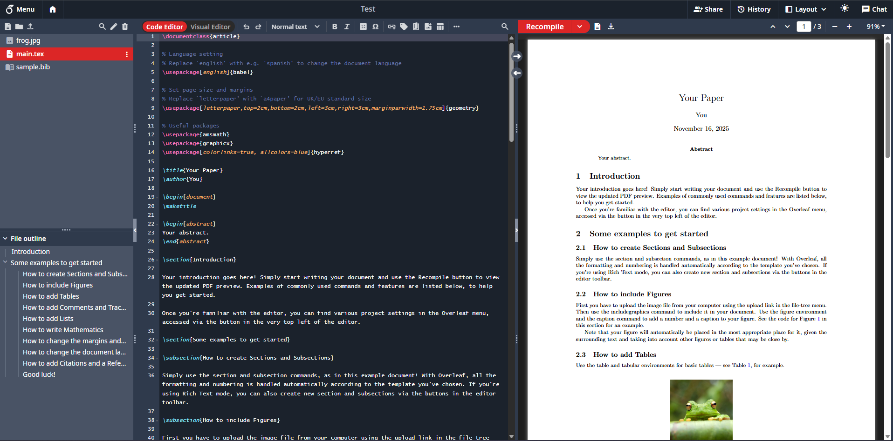

<h1 align="center">
  <br>
  <a href="https://www.overleaf.com"></a>
</h1>

<h4 align="center">A fork of Overleaf, an open-source online real-time collaborative LaTeX editor.</h4>

<p align="center">
  <a href="https://github.com/overleaf/overleaf/">Overleaf</a> •
  <a href="https://github.com/overleaf/overleaf/wiki">Wiki</a> •
  <a href="#contributing">Contributing</a> •
  <a href="#authors">Authors</a> •
  <a href="#license">License</a>
</p>


<p align="center">
  Figure 1: A screenshot of a project being edited in Beaconleaf.
</p>

## Community Edition

[Beaconleaf](https://github.com/TheBeaconCrafter/overleaf) is a fork of [Overleaf](https://www.overleaf.com), an open-source online real-time collaborative LaTeX editor. Overleaf runs a public hosted version at [www.overleaf.com](https://www.overleaf.com), but you can also run your own local version, and contribute to the development of Overleaf.

> [!CAUTION]
> Overleaf Community Edition is intended for use in environments where **all** users are trusted. Community Edition is **not** appropriate for scenarios where isolation of users is required due to Sandbox Compiles not being available. When not using Sandboxed Compiles, users have full read and write access to the `sharelatex` container resources (filesystem, network, environment variables) when running LaTeX compiles.

For more information on Sandbox Compiles check out our [documentation](https://docs.overleaf.com/on-premises/configuration/overleaf-toolkit/server-pro-only-configuration/sandboxed-compiles).

## Beaconleaf vs Overleaf

Beaconleaf is a fork of Overleaf Community Edition with the following enhancements:

- **Global Dark Mode**: Site-wide dark theme support for improved user experience
- **Administrator Tools**: Enhanced administrative features for better server management
- **Symbol Palette**: Professional symbol palette similar to Overleaf Pro, providing quick access to mathematical and special characters

## Planned Features

The following features are planned for future releases:

- [ ] Enhanced admin tools (see online users)
- [ ] Sandboxed compiles
- [ ] Autocomplete of reference keys
- [ ] Template Gallery
- [ ] Git integration
- [ ] AI Features
- [ ] Google Drive Sync

## Known Bugs

The following issues are currently known:

- In dark mode, changing the spacing between text editor and PDF will flashbang you
- In dark mode, opening a project also flashbangs you
- Project URL lookup says "Sorry, we can't find the page you are looking for."

## Building

### Prerequisites

Before building, ensure that `server-ce/Dockerfile` has the correct base image tag:

```dockerfile
ARG OVERLEAF_BASE_TAG=sharelatex/sharelatex-base:main
```

**Important**: Do not use `sharelatex/sharelatex-base:latest` as the base tag.

### Build Steps

1. Build the base and community images:

```bash
cd server-ce
sudo make build-base
sudo make build-community
```

2. Build and start the Docker Compose stack:

```bash
sudo docker compose build
sudo docker compose up
```

Alternatively, you can combine all build steps into a single command:

```bash
sudo make build-base && sudo make build-community && sudo docker compose build && sudo docker compose up
```

## Deployment

### Backup Before Deployment

**Always create a full backup before deploying updates** to prevent data loss.

1. Stop the running stack to ensure MongoDB isn't mid-write:

```bash
cd /path/to/beaconleaf/data
docker compose -f /path/to/docker-compose.yml down
```

2. Create a complete backup archive (includes permissions, owners, symlinks, and all data):

```bash
tar -cvpzf /path/to/output/beaconleaf-backup-$(date +%F).tar.gz \
    sharelatex_data \
    mongo_data \
    redis_data
```

3. Optionally bring the stack back up:

```bash
docker compose -f /path/to/docker-compose.yml up -d
```

### Updating Docker Compose Configuration

Before pulling and building updates, ensure your `docker-compose.yml` uses a build context instead of a pre-built image.

Replace this:

```yaml
image: beaconleaf/sharelatex:texlive-full
```

With this:

```yaml
build:
    context: .
    dockerfile: server-ce/Dockerfile
```

### Deploying Updates

1. Pull the latest changes and build the updated images:

```bash
cd /path/to/compose
git pull
cd server-ce
sudo make build-base && sudo make build-community && sudo docker compose build
```

2. Start the updated stack:

```bash
sudo docker compose up -d
```

### Installing Full TeX Live Scheme (Optional)

To install the full TeX Live scheme for comprehensive LaTeX package support:

1. Execute into the running container:

```bash
docker exec -it sharelatex bash
```

2. Install the full TeX Live scheme:

```bash
tlmgr install scheme-full
tlmgr path add
```

3. Commit the container with the full TeX Live installation to make it persistent:

```bash
docker commit sharelatex beaconleaf/sharelatex:texlive-full
```

4. Update `docker-compose.yml` to use the new image:

Replace this:

```yaml
build:
    context: .
    dockerfile: server-ce/Dockerfile
```

With this:

```yaml
image: beaconleaf/sharelatex:texlive-full
```

For more information on upgrading TeX Live, see the [official Overleaf documentation](https://docs.overleaf.com/on-premises/installation/upgrading-tex-live).

## Contributing

Please see the [CONTRIBUTING](CONTRIBUTING.md) file for information on contributing to the development of Overleaf.

## Authors

[The Overleaf Team](https://www.overleaf.com/about)

[Vincent Wackler](https://github.com/TheBeaconCrafter/overleaf)

## License

The code in this repository is released under the GNU AFFERO GENERAL PUBLIC LICENSE, version 3. A copy can be found in the [`LICENSE`](LICENSE) file.

Copyright (c) Overleaf, 2014-2025.
